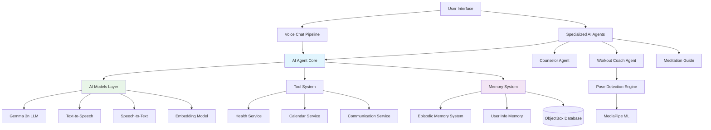
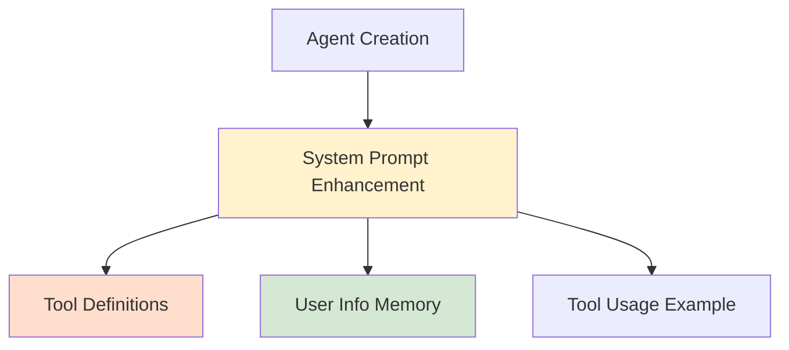
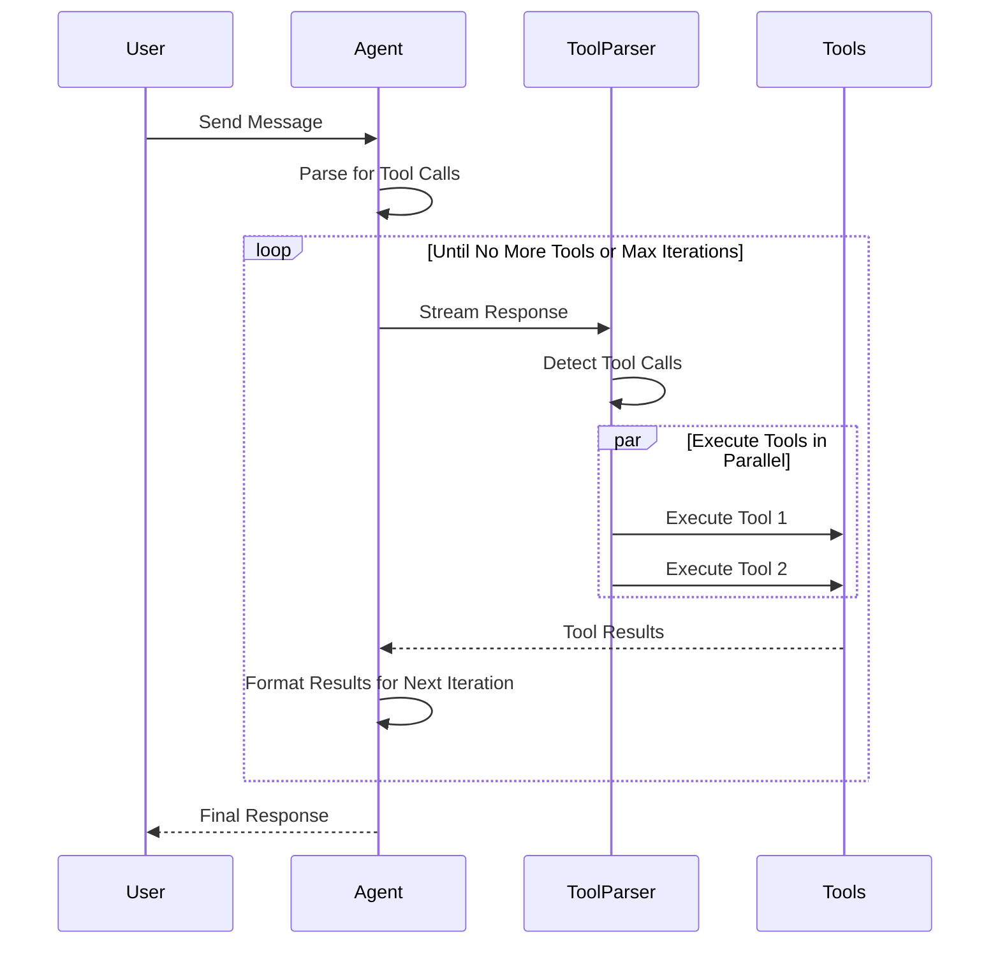
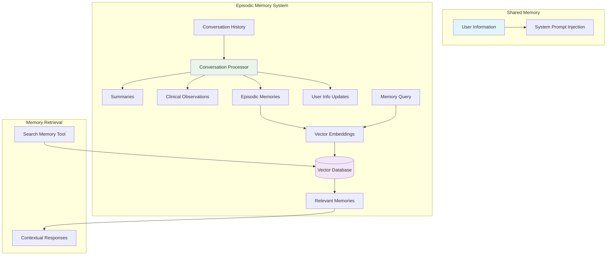
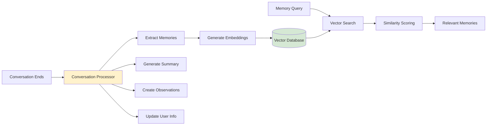
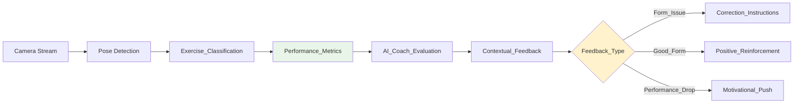
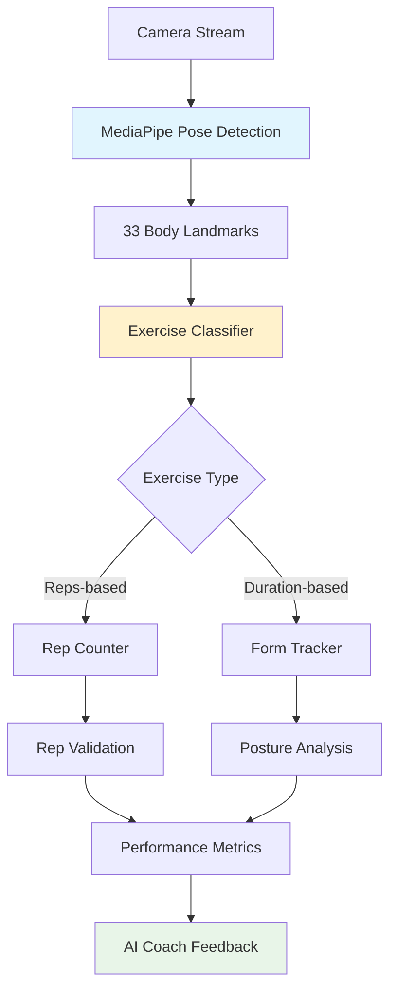
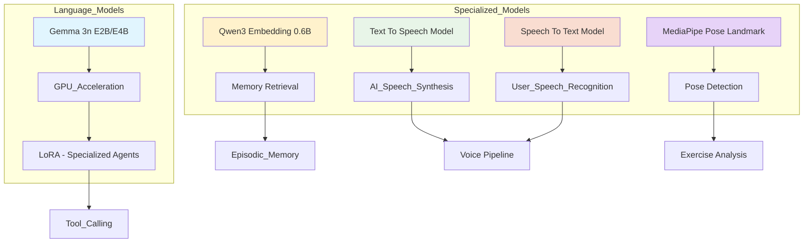
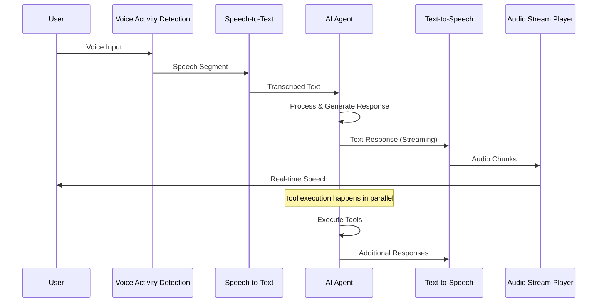
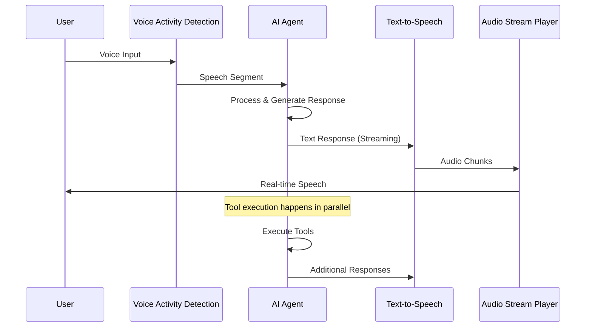

# Waico: WellBeing AI Companion - Technical Writeup

## Overview

Waico (Wellbeing AI Companion) is a Mobile App that leverages Gemma 3n and other on-device AI models to provide personalized wellbeing support through multiple specialized AI agents. The system combines conversational AI with Gemma 3n, computer vision for pose detection with Mediapipe, health data integration, and tailored optimization for on-device performance to create a comprehensive wellbeing platform.

The app operates entirely offline using locally deployed AI models, ensuring user privacy while providing real-time, intelligent interactions across counseling, fitness coaching, and meditation guidance. With more modules to come.

## Core Architecture

### High-Level System Design

## AI Agent System

### Core AI Agent Architecture

The `AiAgent` component serves as the foundation for all AI interactions in Waico. It implements a sophisticated tool-calling system that allows AI models to interact with the real world through a predefined set of tools.

#### Agent Initialization and System Prompt Enhancement

### Tool Execution Pipeline

The agent implements a multi-iteration tool execution system:

This pipeline allows agents to:
- Execute multiple tools in parallel for efficiency
- Chain tool calls across multiple iterations
- Gracefully handle tool failures
- Maintain conversation context throughout tool execution

## Memory Architecture

### Dual Memory System

Waico implements a dual memory system that combines shared user context with agent-specific episodic memories:

### Shared User Information Memory

All agents share access to a centralized user information store that includes:
- **Personal Details**: Name, preferences, goals
- **Professional Contacts**: Therapist, coach, doctor contact information
- **Context Information**: Current situation, ongoing challenges
- **Preferences**: Communication style, triggers to avoid

This information is automatically injected into every agent's system prompt, enabling personalized interactions without requiring users to re-establish context.

### RAG-Based Episodic Memory

The RAG (Retrieval-Augmented Generation) memory system provides long-term episodic memory:

#### Conversation Processing Pipeline

The conversation processor employs multiple AI-driven extraction techniques:

1. **Memory Extraction**: Identifies significant moments worth remembering long-term
2. **Summarization**: Creates concise conversation overviews
3. **Clinical Observations**: Generates professional-grade notes for healthcare providers
4. **User Information Updates**: Maintains current user context

## Specialized AI Agents

### Counselor Agent

The counselor agent provides emotional support and mental health guidance:

**Capabilities:**
- Evidence-based therapeutic approaches (CBT, ACT, mindfulness)
- Active listening and emotional validation
- Progress tracking through health data integration
- Professional communication tools (reports, calls)

**Available Tools:**
- `SearchMemoryTool`: Access to conversation history and insights
- `DisplayUserProgressTool`: Visualize health and wellness metrics
- `ReportTool`: Generate professional reports for healthcare providers
- `PhoneCallTool`: Direct communication with user's support network
- `CreateCalendarSingleEventTool`: Schedule appointments and reminders

### Meditation Guide Generator

Generates personalized meditation sessions with AI-crafted scripts:
...

### Workout Coach Agent

The workout coach specializes in real-time form correction during exercise sessions:

**Key Features:**
- Real-time pose analysis and feedback
- Exercise-specific form corrections
- Motivational coaching adapted to performance
- Safety-first approach to movement correction

**Feedback System:**

The coach analyzes real-time data including:
- Joint positions and angles
- Movement velocity and consistency
- Rep counting accuracy
- Fatigue indicators

### MediaPipe Integration for Pose Detection

Waico leverages MediaPipe for real-time pose detection:

### Exercise Classification System

The system supports multiple exercise types with specialized analysis:

**Reps-based Exercises:**
- Push-ups (standard, knee, wall, incline, decline, diamond, wide)
- Squats (standard, split, sumo)
- Core exercises (crunch, reverse crunch, double crunch, superman)

**Duration-based Exercises:**
- Planks (standard, side planks)
- Wall sits
- Cardio movements (jumping jacks, high knees, mountain climbers)

### Repetition Counting Algorithm

The rep counting system employs state machine logic to accurately track exercise completion:

1. **Pose Validation**: Ensures user is in correct starting position
2. **Movement Tracking**: Monitors key joint trajectories
3. **Phase Detection**: Identifies exercise phases (up/down, in/out)
4. **Completion Validation**: Confirms full range of motion
5. **Quality Assessment**: Evaluates form quality for each rep

## AI Model Infrastructure

### On-Device Model Stack

Waico runs entirely on-device using optimized AI models:

## Voice Chat Pipeline

### Real-Time Voice Interaction

The voice chat pipeline orchestrates seamless voice-based interactions:

Currently, the medipipe versions of Gemma 3n don't support audio input, that's why we are using speech to text models. Once mediapipe support audio modality for Gemma 3n the pipeline will look like this:

## Conclusion

Waico represents a sophisticated convergence of on-device AI, computer vision, and wellness domain expertise. The architecture demonstrates how modern AI systems can provide personalized, intelligent assistance while maintaining complete user privacy through local processing.

The dual memory system, combining shared user context with RAG-based episodic memory, enables continuity and personalization across different interaction modes. The specialized agent architecture allows for domain-specific expertise while maintaining architectural coherence.

The real-time pose detection and feedback system showcases the potential for AI-powered fitness coaching, while the comprehensive health data integration provides holistic wellness insights. The voice-first interaction model, combined with intelligent conversation processing, creates an intuitive and accessible user experience.

This technical architecture serves as a foundation for expanding wellness AI capabilities while maintaining the core principles of privacy, personalization, and intelligent assistance.
