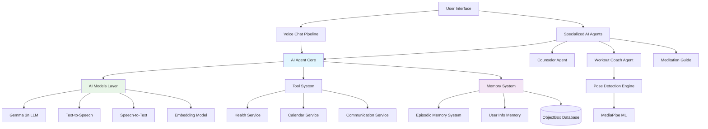
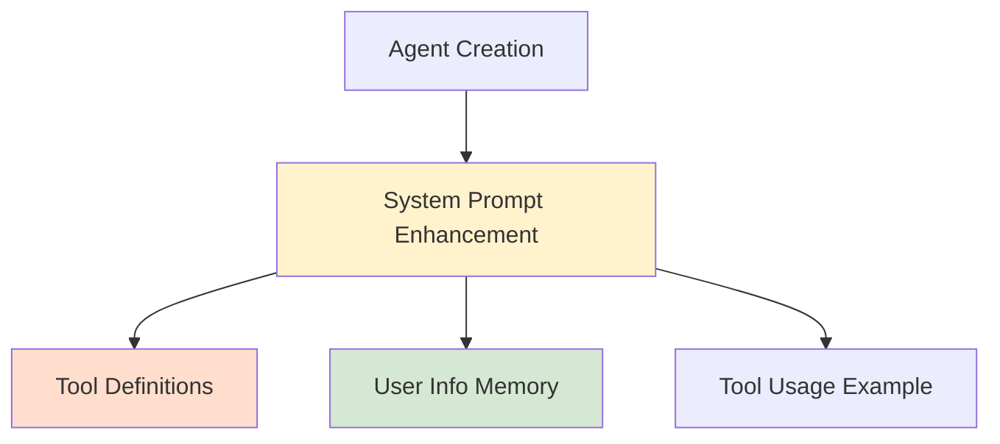
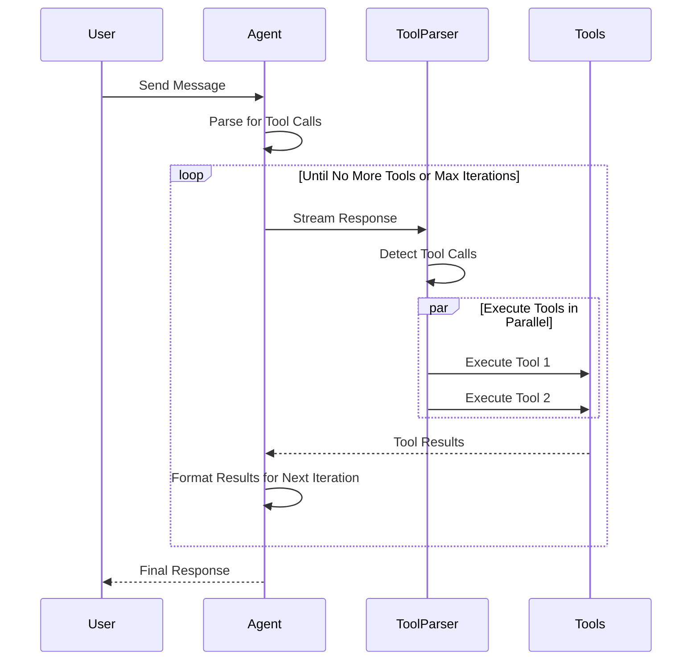
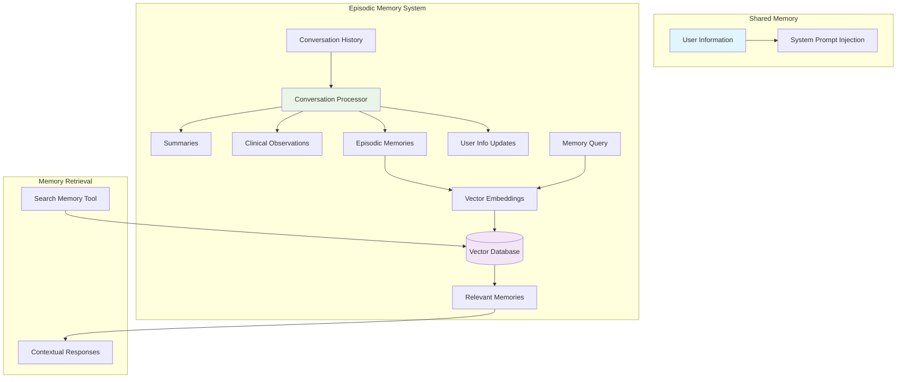
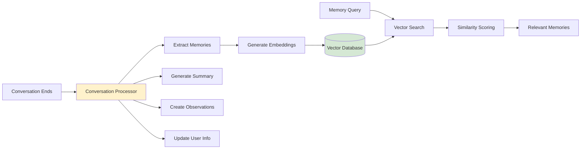
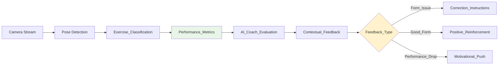
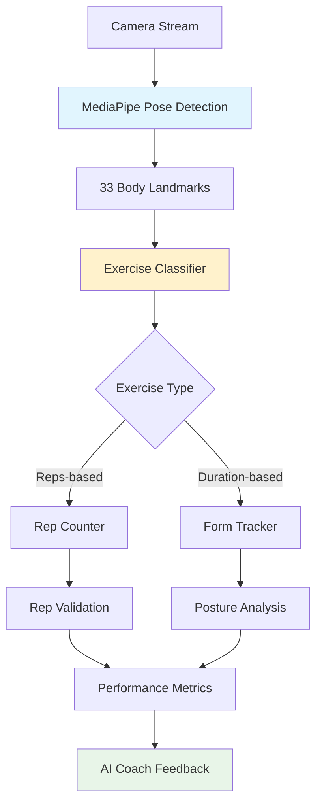
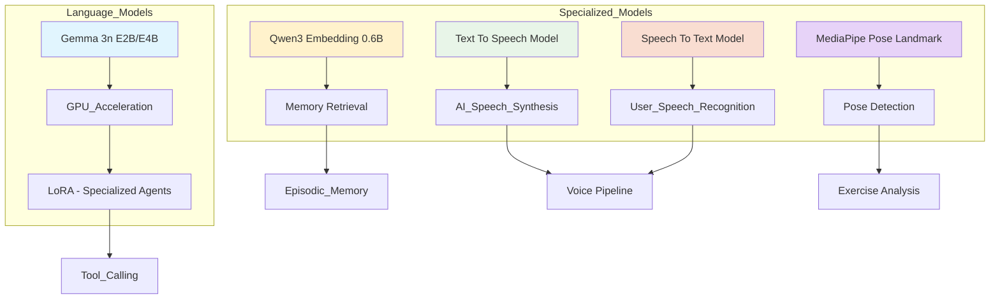
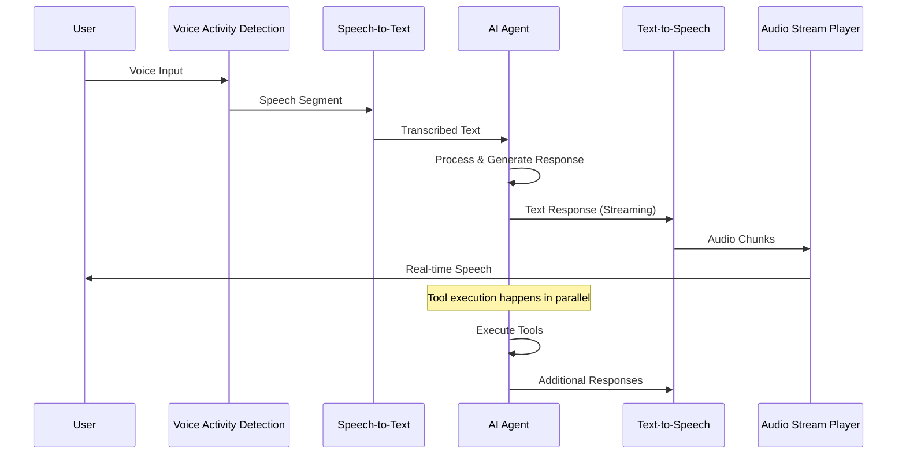
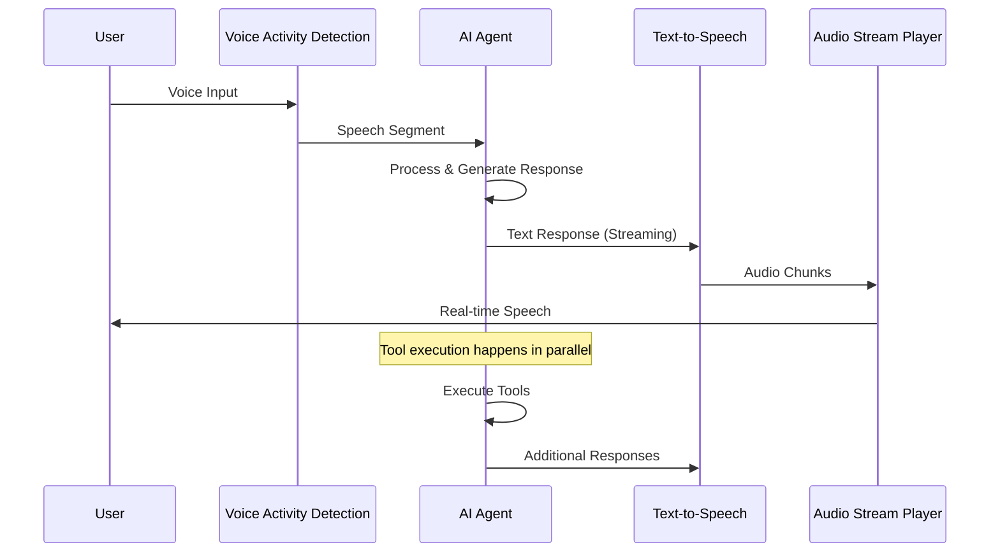

## Overview

Waico (Wellbeing AI Companion) is a Mobile App that leverages Gemma 3n and other on-device AI models to provide personalized wellbeing support through multiple specialized AI agents. The system combines conversational AI with Gemma 3n, computer vision for pose detection with Mediapipe, health data integration, and tailored optimization for on-device performance to create a comprehensive wellbeing platform.

The app operates entirely offline using locally deployed AI models, ensuring user privacy while providing real-time, intelligent interactions across counseling, fitness coaching, and meditation guidance. With more modules to come.

### Why Waico?
Since 2020, during the coronavirus pandemic, the world has seen a significant increase in mental health issues, with many people struggling with anxiety, depression, and loneliness. The numbers keep rising, and the demand for mental health support with them.

Many surveys, including the [Post-Pandemic Remote Work Health Impact 2025](https://www.kaggle.com/datasets/pratyushpuri/remote-work-health-impact-survey-2025/data) show the need for mental health support, with 75% of respondents reporting a mental health status of Anxiety, Burnout, Depression, or PTSD.

>Preliminary downloads for January 2025 were up slightly year-over-year (YoY) to reach their highest total since January 2022. Meanwhile, IAP revenue in January 2025 soared 10% YoY to reach a new all-time high at $385 million.
>Source: [Sensor Tower](https://sensortower.com/blog/state-of-mobile-health-and-fitness-in-2025)

Although there are many apps trying to address this issue, most of them requires you to book an appointment, then pay for the session.
And during the session, if you don't have a stable internet connection, you won't be able to make the most of your session.

Waico aims to solve this problem by providing a fully offline, on-device AI companion that can assist you with your mental health needs anytime, anywhere. It combines the power of advanced AI models with a user-friendly interface to create a personalized wellbeing experience.

Many AI-powered mental health apps will probably emerge. However, conversations with an AI are not protected by the same legal confidentiality laws that apply to licensed human counselors or therapists. Waico mitigates this risk by running all AI models locally on the user's device, ensuring that no data never leaves the device. Making the user in full control of their data and privacy.


## Core Architecture

### High-Level System Design



## AI Agent System

### Core AI Agent Architecture

The `AiAgent` component serves as the foundation for all AI interactions in Waico. It implements a tool-calling system that allows AI models to interact with the real world through a predefined set of tools.

#### Agent Initialization and System Prompt Enhancement



At initialization, each agent's system prompt is dynamically enhanced with contextual information. This includes the available tool definitions, relevant data from the user's information memory, and examples of how to use the tools. This enhancement ensures that the agent is aware of its capabilities and the user's context from the very beginning of the interaction.

### Token-Efficient Tool Calling

To optimize for on-device performance, Waico employs a custom code-based function calling mechanism instead of a standard JSON-based approach. JSON generation by LLMs can be token-intensive, leading to higher memory consumption and slower response times, which are critical constraints on mobile devices.

Our approach defines a clear, code-like syntax for tool calls that the LLM generates directly. For example, instead of generating a JSON object, the model outputs 
````
```tool_call
search_memory(query="The issue that happened at the user's aniversary party when they were 12")
```
````

This method significantly reduces the number of tokens required for both the tool definitions in the system prompt and the generated tool calls, nearly halving the token count compared to JSON. This optimization is crucial for achieving fast, responsive AI interactions on mobile hardware. A parser is then used to interpret these string-based commands and execute the corresponding functions with the provided arguments.

### Tool Execution Pipeline

The agent implements a multi-iteration tool execution system:



This pipeline allows agents to:
- **Execute multiple tools in parallel**: For example, fetching user data and searching memory can happen simultaneously, improving efficiency.
- **Chain tool calls**: An agent can use the output of one tool as the input for another in a subsequent iteration, enabling complex, multi-step workflows.
- **Handle tool failures gracefully**: If a tool call fails, the agent is informed of the error and can attempt to correct it or notify the user.
- **Maintain conversational context**: The agent retains the history of the conversation and tool usage, allowing for coherent and context-aware interactions.

## Memory Architecture

### Dual Memory System

Waico implements a dual memory system that combines shared user context with agent-specific episodic memories:



### Shared User Information Memory

All agents share access to a centralized user information store that includes:
- **Personal Details**: Name, preferences, goals
- **Professional Contacts**: Therapist, coach, doctor contact information
- **Context Information**: Current situation, ongoing challenges
- **Preferences**: Communication style, triggers to avoid

This information is automatically injected into every agent's system prompt, enabling personalized interactions without requiring users to re-establish context. This ensures that every agent, whether it's the Counselor or the Workout Coach, is aware of the user's overall profile and can tailor its responses accordingly.

### RAG-Based Episodic Memory

The RAG (Retrieval-Augmented Generation) memory system provides long-term episodic memory, allowing the agent to recall past conversations and events. This is crucial for maintaining continuity and providing personalized, context-aware support over time.

#### Conversation Processing Pipeline



The conversation processor employs multiple AI-driven extraction techniques:

1.  **Memory Extraction**: Identifies significant moments, key decisions, and important emotional expressions from the conversation that are worth remembering long-term.
2.  **Summarization**: Creates concise overviews of conversations, useful for quick recaps.
3.  **Clinical Observations**: Generates professional-grade notes that can be shared with healthcare providers, capturing relevant details in a structured format.
4.  **User Information Updates**: Detects changes in user information (e.g., new goals, updated contacts) and maintains the shared user context.

These extracted memories are then converted into vector embeddings and stored in a vector database for efficient retrieval. When a user asks a question that requires long-term memory, a search tool queries the vector database to find the most relevant memories, which are then used to generate a contextual response.

## Specialized AI Agents

### Counselor Agent

The counselor agent provides emotional support and mental health guidance. It is designed to be a compassionate and helpful companion, offering a safe space for users to express themselves.

**Capabilities:**
- **Evidence-based therapeutic approaches**: Utilizes principles from Cognitive Behavioral Therapy (CBT), Acceptance and Commitment Therapy (ACT), and mindfulness to guide conversations.
- **Active listening and emotional validation**: Acknowledges and validates the user's feelings, fostering a sense of being heard and understood.
- **Progress tracking**: Integrates with health data to monitor progress and provide insights into the user's wellbeing journey.
- **Professional communication**: Can generate reports and facilitate communication with the user's healthcare providers.

**Available Tools:**
- `SearchMemoryTool`: Accesses important events and milestones extracted from conversations to maintain long-term context.
- `DisplayUserProgressTool`: Visualizes historical health and wellness data.
- `ReportTool`: Generates professional reports for healthcare providers, summarizing progress and key observations.
- `PhoneCallTool`: Initiates direct communication with health services the user's support network, such as a therapist or trusted contact.
- `CreateCalendarSingleEventTool`: Schedules appointments, reminders for medication, or other important events.
There are additional tools already implemented but are not being used at the moment to reduce the complexity until there is a way to use finetuned Gemma 3n model on mobile with mediapipe.

### Meditation Guide Generator

This agent generates personalized, guided meditation sessions. Instead of relying on pre-recorded audio, it creates unique scripts tailored to the user's current needs and mood.

The agent first generates a script that includes pauses of varying lengths (e.g., `...breathe in deeply... [pause 5s] ...and now breathe out...`). This script is then processed by a Text-to-Speech (TTS) model, which converts the text portions into audio chunks. These chunks are saved locally. During playback, the app plays the user's chosen background music and then sequences the audio chunks, inserting silent intervals corresponding to the pauses in the script. This creates a seamless and immersive meditation experience that feels dynamic, responsive and **personalized**.

### Workout Coach Agent

The workout coach specializes in providing real-time form correction and motivation during exercise sessions. It acts as a virtual personal trainer, helping users exercise safely and effectively.

**Key Features:**
- **Real-time pose analysis**: Uses the device's camera to analyze the user's form in real-time.
- **Exercise-specific corrections**: Provides targeted feedback based on the specific exercise being performed.
- **Adaptive motivational coaching**: Adjusts its motivational cues based on the user's performance and signs of fatigue.
- **Safety-first approach**: Prioritizes user safety by identifying and correcting potentially harmful movements.

**Feedback System:**


The coach analyzes real-time data including:
- **Joint positions and angles**: To ensure proper alignment and range of motion.
- **Movement velocity and consistency**: To assess the quality and control of each repetition.
- **Rep counting accuracy**: To track progress and ensure workout goals are met.
- **Fatigue indicators**: Such as slowing rep speed or deteriorating form, to prevent overexertion.

When building such systems with a multimodal LLM, the first thing that you think about is to input the image stream to the LLM, which then outputs feedback and Reps counting. But to accurately do this, your LLM and environment should be able to process around 10 images per second, which is not realistic on mobile devices **as of 2025**.
Thats why I used Mediapipe pose landmark detection to extract the user's body landmarks in realtime, and use holistic algorithms for each supported exercise to validate that the user is fully visible in the camery and is doing the right exercise, determine up/down position, and compute form metrics based on joint angles that can serve as insights for the LLM to provide feedback. 

This same token-efficient approach used for function calling is also applied to workout plan generation. Instead of generating a large JSON object, the model generates a structured text format that is then parsed to create the workout plan. This significantly reduces generation time and makes the feature more responsive.

### MediaPipe Integration for Pose Detection

Waico leverages MediaPipe for real-time, on-device pose detection. This powerful framework provides detailed information about the user's body position without needing to send any data to the cloud.



The process begins with the camera stream, which is fed into the MediaPipe Pose Detection model. The model identifies 33 key body landmarks, providing a detailed, 3D representation of the user's pose. This landmark data is then passed to the Exercise Classifier.

### Exercise Classification System

The system uses the detected pose landmarks, specifically the angles of various body joints, to classify the user's exercise and analyze their form. This allows for a high degree of accuracy in identifying different exercises and their variations.

The system supports multiple exercise types with specialized analysis:

**Reps-based Exercises:**
- **Push-ups**: Standard, knee, wall, incline, decline, diamond, wide
- **Squats**: Standard, split, sumo
- **Core exercises**: Crunch, reverse crunch, double crunch, superman

**Duration-based Exercises:**
- **Planks**: Standard, side planks
- **Wall sits**
- **Cardio movements**: Jumping jacks, high knees, mountain climbers

### Repetition Counting Algorithm

The rep counting system employs a state machine logic to accurately track exercise completion. This ensures that only valid, full-range-of-motion repetitions are counted.

1.  **Pose Validation**: Ensures the user is in the correct starting position before beginning an exercise.
2.  **Movement Tracking**: Monitors the trajectories of key joints to determine if the movement corresponds to the selected exercise.
3.  **Phase Detection**: Identifies the different phases of an exercise (e.g., the upward and downward phases of a squat).
4.  **Completion Validation**: Confirms that the user has completed the full range of motion for a repetition.
5.  **Quality Assessment**: Evaluates the quality of the form for each rep, providing feedback on any deviations.

## AI Model Infrastructure

### On-Device Model Stack

Waico runs entirely on-device using a stack of optimized AI models. This on-device approach ensures user privacy, low latency, and offline functionality.



The core of the language understanding is **Gemma 3n**, a powerful yet efficient large language model. We use LoRA (Low-Rank Adaptation) to create specialized versions of the model for each agent, allowing them to excel at their specific tasks without the need for multiple large models. The models are accelerated using the device's GPU to ensure real-time performance. For memory retrieval, we use the **Qwen3 Embedding 0.6B** model, which is optimized for creating high-quality embeddings while maintaining a small footprint.

## Voice Chat Pipeline

### Real-Time Voice Interaction

The voice chat pipeline orchestrates seamless, real-time voice-based interactions, making it feel like a natural conversation.



The pipeline starts with **Voice Activity Detection (VAD)**, which listens for the user to start and stop speaking. This allows for a hands-free experience. Once a speech segment is detected, it is sent to the **Speech-to-Text (STT)** model, which transcribes the audio into text. This text is then passed to the AI agent, which processes the input and generates a response. The response is streamed to the **Text-to-Speech (TTS)** model, which converts it into audio chunks that are played back in real-time. This streaming approach ensures that the user hears the agent's response as it's being generated, reducing perceived latency.

Currently, the MediaPipe versions of Gemma 3n don't support audio input, which is why we use a separate STT model. Once MediaPipe adds audio modality support for Gemma 3n, the pipeline will be simplified:



This future architecture will allow for an even more seamless and efficient interaction, as the agent will be able to directly process audio input.

## Conclusion

Waico represents a sophisticated convergence of on-device AI, and wellbeing domain expertise. The architecture is designed to provide personalized, intelligent, and private assistance by leveraging the power of modern AI systems running locally on the user's device.

The dual memory system, combining shared user context with RAG-based episodic memory, enables continuity and deep personalization across different interaction modes. The specialized agent architecture allows for domain-specific expertise in counseling, meditation, and fitness, all while maintaining a coherent and unified user experience.

The real-time pose detection and feedback system showcases the potential for AI-powered fitness coaching, while the comprehensive health data integration provides holistic wellness insights. The voice-first interaction model, combined with intelligent conversation processing and token-efficient strategies, creates an intuitive, accessible, and responsive user experience that sets a new standard for wellbeing applications.

